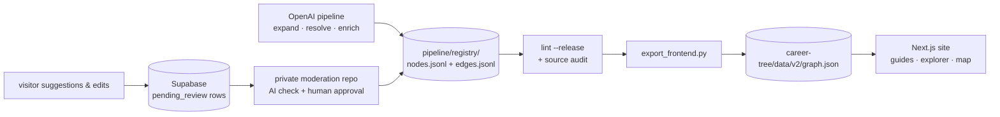

#  Career Tree

**An open, source-backed map of education and career routes in India.**

> *Don't just follow a path. Understand it.*

Live at **[careerstree.in](https://careerstree.in)**.

Career Tree models careers as a **typed directed graph**, not a list or a quiz. Every
entity — a degree, an entrance exam, a job role, a government service — exists exactly
once, carries an immutable stable ID, and connects to every route that can legitimately
reach it. The current release ships:

- **677 canonical nodes** and **1,505 directed edges**
- a **source-backed guide for every node** — every quick fact and article section cites
  at least one public source
- an interactive explorer, per-guide route maps, and a global graph map

This README explains how the system works and how to run everything locally. The
operational deep-dive (production release gates, the Supabase cutover migration, the
moderation dry-run procedure) lives in [`README_v2.md`](README_v2.md).

---

## Features

- **Cited career guides** — `/careers/<type>/<slug>` renders a full article per node:
  quick facts, type-specific sections (eligibility, admission, compensation context, …),
  useful links, per-item source citations, and a "last reviewed" date. Guides emit
  Article JSON-LD and per-node OG images.
- **Contextual explorer** — `/explore/<type>/<slug>?from=<id>` shows a node the way you
  reached it: a parent carousel, the current node, and what can come next. The same BCA
  degree is one node whether you arrived from Class 12 Commerce or from a Polytechnic
  diploma.
- **Route maps** — each guide merges the top routes from Class 10 to that node into a
  small DAG diagram (dagre layout, custom SVG) with the active route highlighted.
- **Global map** — `/map` renders the whole graph in React Flow: one visual node per
  stable ID, edges colored by distance from the root, filterable by text and node type.
- **Crowdsourced, moderated data** — "Suggest a path" and "Edit guide" forms write
  pending rows to Supabase; a private AI + human-in-the-loop review tool merges approved
  changes back into the canonical registry. Nothing goes live unreviewed.
- **AI data pipeline with receipts** — expansion, entity resolution, and enrichment run
  on OpenAI models with structured outputs, a frozen evaluation set, an append-only
  decision ledger, and release lint that blocks incomplete or uncited data.

## Tech stack

| Layer | Tools |
| --- | --- |
| Web app | Next.js 16 (App Router), React 19, TypeScript, Tailwind CSS 4 |
| Visualization | React Flow 11 (global map), dagre (both layouts), custom SVG route maps |
| Community storage | Supabase (Postgres) via `@supabase/supabase-js`, Zod 4 validation |
| Frontend tests | Vitest 4 + Testing Library (jsdom) |
| Data pipeline | Python 3.11+, OpenAI SDK, Pydantic 2, `requests`, PyYAML |
| Pipeline models | `gpt-5.6-terra` (expansion + web-search enrichment), `gpt-5.6-luna` (entity-resolution judge), `text-embedding-3-large` @ 1,024 dims (candidate retrieval) |

---

## How it works

The repo has two halves that meet at one generated file:

- **`pipeline/`** (repo root) — a Python + OpenAI pipeline that grows, resolves,
  enriches, audits, and exports the canonical graph.
- **`career-tree/`** — the Next.js app that renders the exported snapshot.



Three rules keep this honest:

1. **`pipeline/registry/nodes.jsonl` + `edges.jsonl` are the canonical dataset.**
   `career-tree/data/v2/graph.json` is a deterministic export — never hand-edited.
2. **Supabase is not graph storage.** It holds community submissions and their review
   state, nothing else. Public browsing reads only the committed snapshot.
3. **Approved community changes re-enter through the pipeline**, not by editing served
   data — so every release passes the same lint, citation, and integrity gates.

### The data model

Every node ID has the stable form **`<type>:<slug>`** (e.g. `degree:bca`,
`exam:jee-main`). IDs are minted once and never change; renaming a title or adding an
alias does not change identity. Because identity is not a path, the same destination is
never duplicated across routes — the V1 tree's core flaw.

Node types (with current counts):

| Type | Count | | Type | Count |
| --- | --- | --- | --- | --- |
| `job_role` | 210 | | `certification` | 19 |
| `degree` | 125 | | `diploma` | 13 |
| `government_service` | 124 | | `training` | 8 |
| `exam` | 122 | | `stream` | 5 |
| `entrepreneurship` | 50 | | `school_stage` | 1 (the root, `school_stage:class-10`) |

Edges are typed `progression` (548), `exam_gate` (686), or `lateral` (271), with an ID
of `<from_id>-><to_id>` and a grammar enforced in code and lint:

- an edge touches an exam **iff** it is `exam_gate`; exam→exam edges are invalid;
- the `progression` subgraph must be **acyclic** — but the full graph may cycle through
  `lateral`/`exam_gate` edges, because retraining and career switches legitimately lead
  back to earlier kinds of opportunity;
- working-role → education edges are `lateral` (upskilling), never `progression`.

Every node and edge carries creation **provenance** (model, prompt version, generation
date, source URLs). Every node additionally carries a **`facts`** object — the guide
content — with its own enrichment provenance:

```jsonc
{
  "id": "degree:bca",
  "type": "degree",
  "title": "Bachelor of Computer Applications",
  "aliases": ["BCA"],
  "description": "…",
  "is_terminal": false,
  "needs_review": false,
  "facts": {
    "schema_version": 1,
    "last_reviewed": "2026-07-19",
    "quick_facts": [{ "label": "Duration", "value": "3 years", "source_urls": ["https://…"] }],
    "sections": [{ "key": "eligibility", "heading": "…", "paragraphs": ["…"], "bullets": [], "source_urls": ["https://…"] }],
    "useful_links": [{ "label": "…", "url": "https://…", "kind": "official" }],
    "prov": { "model": "gpt-5.6-terra", "prompt_version": "v2-enrichment-1", "generated_at": "…" }
  },
  "prov": { "model": "…", "prompt_version": "…", "generated_at": "…", "source_urls": [] }
}
```

Section keys are whitelisted **per node type** (enforced by Pydantic and release lint):

| Node type | Allowed section keys |
| --- | --- |
| `degree`, `diploma`, `certification`, `training` | `eligibility, duration, curriculum, admission, costs, next_options` |
| `exam` | `purpose, eligibility, format, application_process, preparation, outcomes` |
| `job_role`, `government_service` | `responsibilities, entry_routes, skills, workplace, progression, compensation_context` |
| `entrepreneurship` | `entry_routes, capabilities, operating_model, compliance, growth_paths` |
| `school_stage`, `stream` | `subjects, selection_considerations, future_routes` |

### The data pipeline (`pipeline/`)

The pipeline is a sequence of small, resumable scripts run from the repo root:

| Stage | Script | What it does |
| --- | --- | --- |
| Bootstrap | `bootstrap.py` | Seeds the registry from `vocab.yaml` (root, streams, flagship degrees) and `ground/exams.json` — a curated table of 103 real Indian entrance/recruitment exams, so a hallucinated exam becomes an integrity failure instead of a new node. Embeddings only; no generative calls. |
| Expansion | `expand.py --max-depth 4` | BFS over registry **nodes** (never paths). `gpt-5.6-terra` proposes 4–10 successors per node with structured output; every new title passes entity resolution before an ID is minted; the edge grammar and progression-cycle check run at write time. Frontier state persists in `state/frontier.json` after every node. |
| Entity resolution | `resolve.py` (library) | See below. |
| Enrichment | `enrich.py --retry-failures --workers 8` | `gpt-5.6-terra` with web search researches each node lacking facts and returns the strict `NodeFacts` schema. Saves after every node, skips completed ones, records failures in a ledger, runs bounded parallel workers, and aborts after 5 consecutive failures. |
| Source audit | `audit_sources.py` | Checks every cited URL without storing page bodies: public HTTP(S) hosts only, bounded timeouts, at most 5 re-validated redirects. `404`/`410` and malformed URLs are definitive failures (exit 1); `401`/`403`/`405` still prove the endpoint exists. |
| Release lint | `lint.py --release` | The free, deterministic gate — see the invariants below. |
| Export | `export_frontend.py` (and `--check`) | Validates the registries and atomically writes `career-tree/data/v2/graph.json` (sorted, with a source digest). `--check` verifies the committed snapshot still matches the registries. A validation failure never clobbers the existing file. |
| ER calibration | `calibrate_er.py --write` | Recomputes the embedding-shortlist band against the frozen evaluation labels and updates `eval/er_openai_report.json`. |

**Entity resolution** is the heart of the graph's integrity. When expansion proposes a
title, `resolve.py` climbs a ladder:

1. Aggregate titles ("X or Y") are rejected outright; bare generics ("Ph.D.") are
   domain-qualified from their parent first.
2. An **exact normalized title/alias match** within the same type links directly — no
   model call.
3. Otherwise the candidate is embedded and cosine-shortlisted against same-type nodes.
   **Similarity never auto-merges**: calibration against 655 frozen human-labeled pairs
   (`pipeline/eval/er_labels.json`) showed that even 0.95-cosine pairs are wrong 30% of
   the time (qualifier siblings like "MBA (Finance)" vs "MBA (HR)" score 0.99+).
   Everything above the calibrated band (currently 0.60) goes to `gpt-5.6-luna`, a
   judge constrained by the 12-rule decision table in [`pipeline/RUBRIC.md`](pipeline/RUBRIC.md).
4. A `distinct` or `unsure` verdict mints a new node (uncertain cases flagged
   `needs_review`). The standing preference is to **under-merge**: a missed merge is an
   additive fix later, while a wrong merge silently corrupts every route sharing the
   entity.

Every decision is appended to the committed ledger
`pipeline/ledger/er_decisions.jsonl`.

**Cost control and resumability.** Every OpenAI call is cached by an exact key
(provider + model + prompt version + schema + prompt + tools), and embeddings likewise —
so re-running an unchanged stage replays from local caches for free. Registry writes are
atomic and sorted for clean diffs. Runtime caches and usage ledgers under
`pipeline/ledger/` are gitignored (only the ER decision ledger is committed).

**Release invariants** (`lint.py --release` fails the build unless all hold):

- every edge endpoint resolves; IDs and type prefixes are well-formed; no duplicate
  `(type, slug)` routes; the edge grammar holds; the `progression` subgraph is acyclic;
- every node has `facts`, only type-allowed section keys, and **at least one public
  source URL on every quick fact and every section**;
- no frontier work below depth four remains; the enrichment-failure ledger is empty;
- every non-exam node is reachable from `school_stage:class-10`;
- the exported snapshot structurally matches the registries.

### The web app (`career-tree/`)

The entire graph is bundled at build time via a single `server-only` module
(`lib/v2/data.ts`) — there is no runtime database read for browsing. All guide and
explorer pages are statically generated (`generateStaticParams` over all 677 nodes,
`dynamicParams = false`, so unknown routes are real 404s).

| Route | What it is |
| --- | --- |
| `/` | Hero + live community counters (Supabase head-counts, ISR every 300 s, graceful 0 on error). |
| `/search` | Statically prerendered searchable directory of all nodes, with type filters and alias matching. |
| `/careers/<type>/<slug>` | The canonical guide. Indexable, canonical URL, Article JSON-LD whose `citation` list unions every source in the node, per-node OG image at `/og/<type>/<slug>`. |
| `/explore/<type>/<slug>?from=<id>` | The interactive explorer. Every parent variant is prebuilt server-side and the client swaps views by the `?from=` param — so context never breaks static generation. Explorers are `noindex,follow` with their canonical pointing at the guide, and are excluded from the sitemap. |
| `/map` | Global React Flow map; dagre layout runs at build time; only visible elements render, so panning stays light. Clicking a node opens its guide. |
| `POST /api/suggest` | Propose a new successor under a parent node. |
| `POST /api/edit` | Propose changes to an existing guide. |
| `/sitemap.xml`, `/robots.txt` | Guides only; `/api/` disallowed. |

The two APIs share a pipeline: per-IP rate limit (5 requests/min, `Retry-After` on 429)
→ strict Zod schemas (unknown fields rejected, stable-ID regex) → graph existence
checks → insert with `status: 'pending_review'`. Suggestions are rejected `409` when a
child with that title or alias already exists; edits are rejected `409` as no-ops —
and the server derives `original_data` from the snapshot itself, so a client can never
forge what it claims to be editing.

Supabase's two tables (`suggestions`, `edits` — see
[`career-tree/supabase/schema.sql`](career-tree/supabase/schema.sql)) have RLS enabled
with **no policies**: anonymous clients can touch nothing, and only the server-side
service-role key (never shipped to the browser) can write. Rows are never deleted by the
public app; the private review tool flips `status` to `approved`/`rejected` and merges
approved content back into the JSONL registry through the canonical resolver, lint, and
export.

---

## Repository layout

```text
pipeline/                     canonical data pipeline (run from repo root)
  registry/nodes.jsonl        ← canonical node registry (677)
  registry/edges.jsonl        ← canonical edge registry (1,505)
  state/frontier.json         resumable BFS expansion state
  eval/                       frozen ER labels (655 pairs) + calibration report
  ledger/er_decisions.jsonl   committed ER audit trail (runtime caches gitignored)
  ground/exams.json           curated table of 103 real exams
  vocab.yaml                  seed nodes/edges, qualifiers, abbreviations
  RUBRIC.md                   the 12-rule entity-resolution rubric
  tests/                      43 unittest tests
career-tree/                  Next.js app (run npm from here)
  app/                        routes, API handlers, OG images, sitemap
  components/v2/              guide, explorer, map, and contribution UI
  lib/v2/                     graph engine, route search, layouts, URLs
  lib/                        Zod schemas, Supabase client, rate limiter
  data/v2/graph.json          the committed generated snapshot (~11 MB)
  supabase/                   clean schema + production cutover migration
migration/                    historical ER labeling artifacts from the V1→V2 effort
README_v2.md                  deep technical / release-operations guide
```

---

## Setting it up locally

### Prerequisites

- **Node.js 20+** — for the web app
- **Python 3.11+** — only if you want to run the data pipeline
- No API keys are needed to browse, build, or test the site: the full dataset is
  committed.

### 1. Clone

```bash
git clone https://github.com/mhardik003/career-tree.git
cd career-tree
```

### 2. Run the web app

The Next.js project lives in the `career-tree/` subdirectory:

```bash
cd career-tree
npm install
npm run dev        # http://localhost:3000
```

That's the whole setup for browsing — guides, explorer, search, and the map read only
the committed `data/v2/graph.json`.

### 3. (Optional) Supabase, for the contribution forms and counters

Without credentials the site still runs: the homepage counters render 0 and the
suggest/edit APIs return errors. To enable them, create a Supabase project, run
[`career-tree/supabase/schema.sql`](career-tree/supabase/schema.sql) in its SQL editor,
and create `career-tree/.env.local`:

```env
SUPABASE_URL=https://<project>.supabase.co
SUPABASE_SERVICE_ROLE_KEY=<server-side-secret>
```

Both values are server-only. The service-role key bypasses RLS — never import it into
client code, log it, or commit it.

### 4. (Optional) Run the data pipeline

Only needed to regenerate or extend the dataset. Install the pinned dependencies and
put your key in a repo-root `.env` (gitignored — never commit it):

```bash
python -m pip install -r pipeline/requirements.txt
echo 'OPENAI_API_KEY=sk-…' > .env
```

The free, no-key commands you'll actually use day-to-day:

```bash
python pipeline/lint.py --release          # structural + release invariants
python pipeline/audit_sources.py           # verify every cited URL (network, no key)
python pipeline/export_frontend.py         # regenerate the frontend snapshot
python pipeline/export_frontend.py --check # verify the committed snapshot is current
python -m unittest discover -s pipeline/tests -v
```

The paid, key-requiring stages (run deliberately — these call OpenAI, though exact-match
caching makes unchanged re-runs free):

```bash
python pipeline/calibrate_er.py --write        # recalibrate the ER shortlist band
python pipeline/expand.py --max-depth 4        # grow the graph (resumable)
python pipeline/enrich.py --retry-failures --workers 8   # research cited facts
```

All scripts anchor their paths to their own location, so any working directory works.
`bootstrap.py` exists to seed a from-scratch registry and is not needed on the
committed dataset.

### 5. Verify everything

| Check | Command (from) | Expected |
| --- | --- | --- |
| Pipeline tests | `python -m unittest discover -s pipeline/tests -v` (root) | 43 tests pass |
| Release lint | `python pipeline/lint.py --release` (root) | zero errors; 677 nodes, 1,505 edges |
| Snapshot freshness | `python pipeline/export_frontend.py --check` (root) | "snapshot is current" |
| Frontend tests | `npm test` (`career-tree/`) | 80 tests across 29 files pass |
| Frontend lint | `npm run lint` (`career-tree/`) | clean |
| Production build | `npm run build` (`career-tree/`) | succeeds — no env vars required |

---

## Contributing

Career data should be a public good, not a trade secret.

- **Data (easiest):** use the site's "Suggest a path" / "Edit guide" forms. Submissions
  land in moderation and are reviewed (AI-assisted, human-approved) before merging.
- **Code:** fork, branch, and open a PR. Please add a regression test for any graph,
  API, routing, or release-gate bug you fix.
- **Data via PR:** edit the JSONL registries (never `graph.json` directly), keep stable
  IDs intact, cite public sources for every fact, then run lint → audit → export and
  commit the regenerated snapshot.

Ground rules worth repeating: preserve stable IDs (titles and aliases may change;
identity may not), prefer under-merging entities, and keep credentials, caches, and
private moderation material out of Git. The full production release procedure — gates,
the destructive Supabase cutover, the moderation dry run — is in
[`README_v2.md`](README_v2.md).

## 📝 Update Log

*   **2026-07-20** — Facts moved out of the server module graph: `export_frontend.py` now also emits `graph.core.json` (all nodes minus `facts`, ~1 MB) plus one `data/v2/facts/{type}--{slug}.json` per node, the app's graph singleton loads the core snapshot, and guide/explorer pages re-attach facts to the focused node on demand via `lib/v2/facts.ts` — shrinking the server data chunk every route loads from 8.8 MB to 0.77 MB (with `outputFileTracingIncludes` keeping the facts files deployable).
*   **2026-07-20** — `next build` static-generation workers are now capped at 4 (`experimental.cpus` in `next.config.ts`); each worker holds the full graph dataset, so the cap keeps peak build memory bounded on many-core machines (measured 8.3 GB → 3.5 GB aggregate RSS).
*   **2026-07-20** — Explore pages stopped shipping one full page view per parent: the client now overlays a small per-parent context (`routes`/`selectedParentId`/`backHref`) on a single canonical view, client-bound edges and node summaries dropped unrendered fields (`prov`, `description`, `is_terminal`), taking `/explore/exam/cat` from ~123 KB to ~94 KB.
*   **2026-07-20** — Explore/guide page payloads slimmed: parents and children now cross the server→client boundary as cached `V2NodeSummary` objects instead of full fact-laden nodes, cutting the heaviest prerendered page (`/explore/exam/cat`) from ~1 MB to ~123 KB.
*   **2026-07-20** — The searchable canonical directory moved from the homepage to a dedicated, statically prerendered `/search` page (now in the sitemap); the hero's "Search for a career" button is a plain link there, and the scroll-to-search button component was removed.
*   **2026-07-20** — README rewritten around the V2 architecture (this document), with `README_v2.md` added as the technical/release companion. Guide pages also regained their explorer context after a route-refactor regression, the guide back button now uses browser history, the unreachable-route test fixture was refreshed, and the lost `BUGS*.md` local-log ignore rule was restored.
*   **2026-07-19** — V2 reached release completeness and replaced V1 in production: every one of the 677 nodes now has a source-cited guide; release lint enforces per-type fact sections; citation audits are restricted to public hosts; the homepage became V2 search + Class 10 exploration; guides moved to `/careers/…`, the explorer to `/explore/…`; the global map was rebuilt from stable IDs; sitemap/metadata published; the V1 routes and the `/v2` preview surface were removed. Suggestions and edits now use stable node IDs end-to-end, with a clean V2 Supabase schema and a destructive, transaction-guarded cutover migration.
*   **2026-07-19** — The data pipeline moved to OpenAI: a cached structured-output provider (`gpt-5.6-terra` expansion and web-search enrichment, `gpt-5.6-luna` ER judge, `text-embedding-3-large` @ 1,024 dims), recalibrated entity-resolution band, expansion completed through depth four, bounded-parallel enrichment with a failure ledger, and hard release gates (`lint --release`, source audit, `export_frontend.py --check`).
*   **2026-07-17** — The V2 frontend was built behind a preview surface: focus pages with a parent carousel, the searchable career directory, the guide/explorer URL split, carried-through exploration context, and merged per-guide route maps.
*   **2026-07-16** — `careerstree.in` verified in Google Search Console (domain pointed 2026-07-10).
*   **2026-07-04** — The V2 pivot: a from-scratch registry pipeline (entity-resolution rubric, 655 frozen labeled pairs, curated 103-exam ground table, validator, mechanical edge derivation) replaced the earlier migration approach; the first 83-node core build landed with generation-time hardening (retries, upskilling-lateral rule, exam→exam ban).

<details>
<summary>V1 update log (2025-12-14 → 2026-07-03, kept for history)</summary>

*   **2026-07-03** — Correction: the earlier "untrack pyvis artifacts" change only committed the `.gitignore` rules — `career_map.html` (2.4MB) and the pyvis `lib/` support files (vis.js, tom-select) were in fact still tracked. They are now actually removed from the index; the files stay on disk for local use.
*   **2026-07-03** — Housekeeping sweep: removed the unused `react-hook-form` dependency, the dead `get_clean_schema` helper, and the empty `app/api/remove/` directory; fixed the placeholder `your-username` GitHub URLs (README clone command, and the about page's GitHub button is back, pointing at the real repo).
*   **2026-07-03** — The crawler now enforces what its prompt only asked for: `/` in Gemini-returned titles is replaced with `|` (a `/` would corrupt the path-keyed data model), and a child whose name slugifies identically to an earlier sibling ("AI ML" vs "AI | ML") is dropped with a warning instead of silently shadowing it in the app's URL lookup. The Python `slugify` mirrors `lib/slugify.ts` exactly.
*   **2026-07-03** — Modal polish: the suggest/edit modals now close on Escape and on clicking the backdrop; EditModal's network-error path uses the inline error banner instead of a browser `alert()`; and the expand chevron on the current node only renders when there is rich metadata to show (previously it appeared on all 518 metadata-less nodes and did nothing when clicked).
*   **2026-07-03** — Untracked the generated pyvis artifacts (`career_map.html`, 2.5MB, and `lib/bindings/utils.js`) and gitignored them — they are build output of `visualise_tree.py`, not source.
*   **2026-07-03** — `visualise_tree.py` no longer calls `net.get_nodes()` (a full list scan) for every child while wiring edges — it snapshots the node IDs into a set once. Output is identical; most of the remaining runtime is pyvis's own per-edge validation.
*   **2026-07-03** — The global map (`/map`) now only renders nodes inside the viewport (React Flow's `onlyRenderVisibleElements`): the DOM went from a constant 2,703 node elements (~28,600 elements total) to ~250 at the initial view and ~15 when zoomed in, making pan/zoom much lighter on low-end devices.
*   **2026-07-03** — Hardened the suggest/edit APIs: suggestions are now rejected when the parent node doesn't exist in the tree (400) or when the suggested child already exists under it (409, compared by URL slug), edits are rejected for unknown node keys, and malformed JSON bodies return 400 instead of 500. The Zod schemas moved out of the route files into `lib/schemas.ts` (route modules should only export handlers).
*   **2026-07-03** — The crawler's fresh-start seed node was `"10th Class (India)"`, which doesn't match the actual tree root `"10th Class"` — a from-scratch run would have grown a second, divergent root. It now seeds `"10th Class"`.
*   **2026-07-03** — Fixed `generate_metadata_gemini.py`'s single-node helper storing metadata under the node title instead of the full path key (making it invisible to the app), and exposed it as `--node "<full path>"` to regenerate one node's metadata.
*   **2026-07-02** — Shrunk the site icons: all five copies of the logo (favicon, app icons, header logo, README logo) were the full 1.9MB 1024×1024 PNG — ~10MB served with every first visit. They are now properly sized (32px favicon, 180px apple-touch, 64px header, multi-size `.ico`), ~52KB in total.
*   **2026-07-02** — Pipeline scripts (`generate_tree_gemini.py`, `generate_metadata_gemini.py`, `visualise_tree.py`) now read/write `career-tree/data/` directly — the files the app actually serves — instead of dumping to the current working directory, where generated data was invisible to the site and the crawler couldn't resume from existing data. Paths are anchored to the script location, so they work from any cwd.
*   **2026-07-02** — The root `.gitignore` ignored itself and was therefore untracked, so fresh clones had no ignore rules at the repo root where `.env` (Gemini key) lives. It no longer ignores itself and is now committed; local bug logs (`BUGS*.md`) are ignored too.
*   **2026-07-02** — Fixed the Edit modal telling users to separate list items with commas while the parser split on semicolons, which merged e.g. "JEE, BITSAT, VITEEE" into one item. Semicolons are the separator (many data items contain commas); the header and placeholders now say so. Also: `generate_tree_gemini.py` now loads `.env` and fails fast if `GEMINI_API_KEY` is missing, instead of sending a placeholder key.
*   **2026-07-02** — Fixed the suggest/edit API rate limiter: it was one global bucket shared by all visitors (7 requests/min site-wide); it now limits per client IP (5 requests/min, `Retry-After` on 429) with no external dependency — the `limiter` package is gone.
*   **2026-07-02** — Moved the tree data server-side: explore and map are now server components, so the ~5.4MB JSON bundle no longer ships to the browser and the dagre map layout runs at build time. All 2,703 node pages are statically generated with per-node titles/descriptions; added `sitemap.xml`, `robots.txt`, and real HTTP 404s for unknown paths.
*   **2026-07-02** — Migrated crowdsourcing storage from MongoDB (Mongoose) to Supabase (Postgres). Homepage community stats are now counted live from Supabase (all submissions, any status) instead of a static `stats.json`; submissions are never deleted, only flipped between `pending_review`/`approved`/`rejected`.
*   **2025-12-14** — Initial public release: Next.js app + Gemini data pipeline.

</details>

## 📄 License

This project is licensed under the **MIT License** — see the [LICENSE](LICENSE) file for details.
